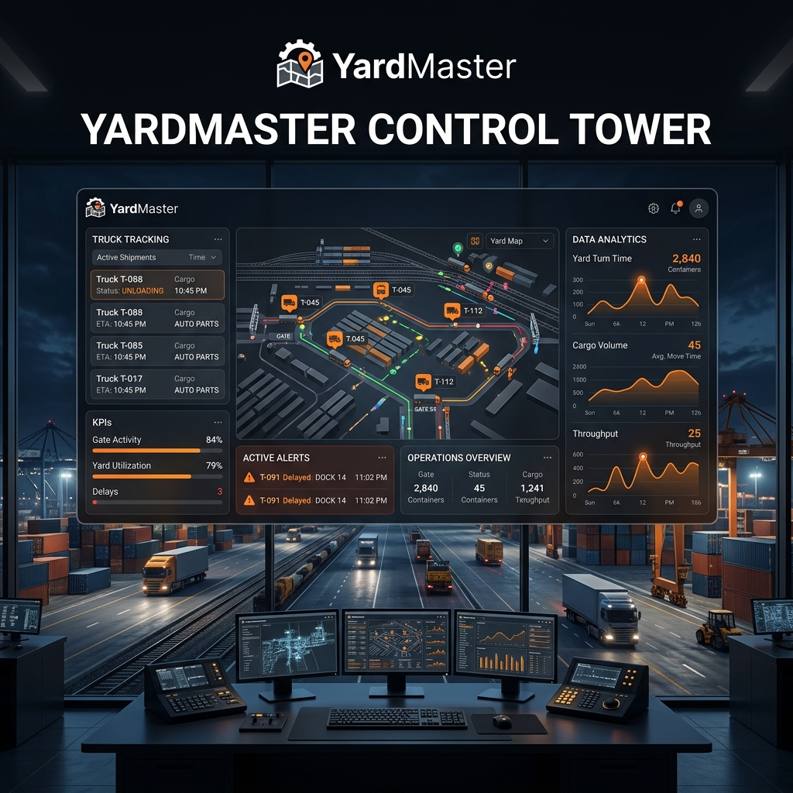

# 🏗️ YardMaster: Operational Control Tower



**YardMaster** is a next-generation operational control-tower platform for yard and trailer logistics. Designed for high-throughput distribution centers, it provides real-time visibility and automation across the entire vehicle lifecycle—from gate entry to dock assignment.

---

## 🚀 Key Features

### 🏢 Gate Automation
- **Smart Check-in/Out**: Automated OCR for license plates and trailer numbers.
- **Manual Overrides**: Triage queue for low-confidence reads with soft-locking to prevent concurrent edits.
- **Self-Service PWA**: Mobile-optimized QR-based driver check-in.

### 🗺️ Real-time Yard Management
- **Dynamic Yard Map**: Live slot occupancy with zone-based filtering.
- **Auto-Assignment**: Smart logic to assign the best matching empty slots or enqueue trucks.
- **Parking Queue**: FIFO management for arriving vehicles.

### ⚖️ Weighbridge Control
- **Precision Capture**: Inbound and outbound weight logging.
- **Deviation Alerts**: Automatic flagging of overweight loads (±5% deviation).
- **Audit Trail**: Detailed history of all weight overrides and reviews.

### 🤖 AI Operations
- **Predictive ETAs**: Machine learning-based arrival predictions with confidence ranges.
- **Smart Re-spotting**: AI-suggested trailer moves to optimize yard flow.
- **Congestion Heatmaps**: Analytics on throughput and dwell-time distribution.

### 📱 Communication & Tasks
- **Driver Alerts**: Automated Twilio SMS notifications for task assignments.
- **Task Management**: SLA tracking for yard moves with live activity feeds.

---

## 🛠️ Tech Stack

- **Frontend**: [TanStack Start](https://tanstack.com/router/v1/docs/start/overview) (React 19 + TanStack Router)
- **Backend**: Supabase (PostgreSQL, Realtime, RLS)
- **Styling**: Tailwind CSS v4
- **State Management**: TanStack Query v5
- **Deployment**: Netlify (Serverless SSR)
- **Integrations**: Twilio (SMS), Lovable AI Gateway (Gemini/GPT)

---

## 📦 Local Setup

### Prerequisites
- Node.js 20+
- npm, pnpm, or bun

### 1. Clone the Repository
```bash
git clone https://github.com/your-username/yardmaster.git
cd yardmaster
```

### 2. Install Dependencies
```bash
npm install
```

### 3. Environment Configuration
Create a `.env` file in the root and add your credentials:
```env
VITE_SUPABASE_URL=your_supabase_url
VITE_SUPABASE_PUBLISHABLE_KEY=your_anon_key
SUPABASE_SERVICE_ROLE_KEY=your_service_role_key
TWILIO_ACCOUNT_SID=your_twilio_sid
TWILIO_AUTH_TOKEN=your_twilio_token
```

### 4. Start Development Server
```bash
npm run dev
```
Open [http://localhost:8080](http://localhost:8080) to view the app.

---

## 🌐 Deployment

This project is pre-configured for **Netlify**.

1. Push your code to GitHub.
2. Connect your repo to Netlify.
3. Set the build command to `npm run build` and publish directory to `dist/client`.
4. Add the environment variable `NITRO_PRESET=netlify` in Netlify settings along with your Supabase/Twilio keys.

---

## 📜 License

This project is licensed under the MIT License - see the [LICENSE](LICENSE) file for details.

---

Built with ❤️ for logistics excellence.
